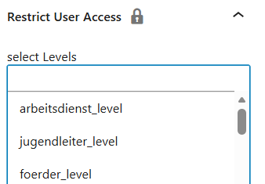

# Restrict User Access Block

This WordPress plugin extends the functionality of the [Restrict User Access](https://wordpress.org/plugins/restrict-user-access/) plugin by adding the ability to hide Gutenberg blocks based on user access levels.

## Features

- **Hide Gutenberg Blocks:** Easily restrict the visibility of individual Gutenberg blocks for specific user access levels.
- **Seamless Integration:** Works directly with the Restrict User Access plugin, leveraging its access levels and rules.
- **Intuitive UI:** Adds a simple interface to the block editor for selecting which access levels can view each block.

## How It Works

When editing a post or page in the Gutenberg editor, you will find a new panel in the block settings sidebar. This panel allows you to select one or more Restrict User Access levels. Only users with the selected access levels will be able to see the block on the front end.

## Requirements

- WordPress 5.0 or higher
- [Restrict User Access](https://wordpress.org/plugins/restrict-user-access/) plugin installed and activated

## Installation

1. Upload the plugin files to the `/wp-content/plugins/restrict-user-access-block` directory, or install the plugin through the WordPress plugins screen directly.
2. Activate the plugin through the 'Plugins' screen in WordPress.
3. Make sure the Restrict User Access plugin is also activated.

## Usage

1. Edit any post or page using the Gutenberg editor.
2. Select a block you want to restrict.
3. In the block settings sidebar, find the "Restrict User Access" panel.
4. Select the access levels that should be able to view the block.
5. Update or publish your post/page.

Blocks without any access level selected will be visible to all users by default.

## License

This plugin is licensed under the MIT License. See the LICENSE file for details.

## Credits

- [Restrict User Access](https://wordpress.org/plugins/restrict-user-access/) by devowl.io
- Developed by [Your Name or Company]
